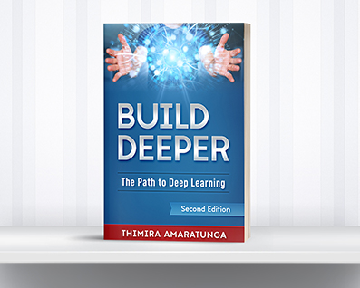

# Build Deeper: The Path to Deep Learning - Sample Code

This is the sample code repository for the book **[Build Deeper: The Path to Deep Learning](https://www.amazon.com/dp/1793223017)**.

This repository contains the code examples discussed the following chapters of the book:

  - Chapter 5 : Build Your First Deep Learning Model
  - Chapter 6 : Looking Under the Hood
  - Chapter 7 : What Next?
  - Chapter 8 : Build Our Own Image Classifier with Transfer Learning
  - Chapter 9 : Bonus – Getting Started with Computer Vision

### Buy the book
## Paperback
  - [Amazon.com](https://www.amazon.com/dp/1793223017)
  - [Amazon.co.uk](https://www.amazon.co.uk/dp/1793223017)
  - [Amazon.de](https://www.amazon.de/dp/1793223017)
  - [Amazon.fr](https://www.amazon.fr/dp/1793223017)
  - [Amazon.es](https://www.amazon.es/dp/1793223017)
  - [Amazon.it](https://www.amazon.it/dp/1793223017)
  - [Amazon.co.jp](https://www.amazon.co.jp/dp/1793223017)

## Kindle eBook
  - [Amazon.com](https://www.amazon.com/dp/B07MY5Y643)

### Website
[**Codes of Interest**](https://www.codesofinterest.com/)

### Author
  - Thimira Amaratunga*
    - [Blog : *Codes of Interest*](https://www.codesofinterest.com/)
    - [Amazon Author Page](https://www.amazon.com/author/thimira)

### About the Book
Deep Learning is no longer shrouded in mystery. In fact, it is the emerging new frontier – the bleeding edge – of AI.  It is increasingly achieving superhuman feats and evolving beyond human comprehension. From image and voice recognition, to AI personal assistants and self-driving cars, achievements and breakthroughs that were once mere science fiction are now becoming our reality. Top tech companies world over are all in the game – trying to win the race for AI, with Deep Learning.

The question now is, do you want to simply be a bystander in this new-age game?

The art of building deep learning systems is becoming easier every day.

This book can be your guide to discovering it yourself.

Build Deeper is a complete and practical guide that can help you take the first few steps in deep learning. It will guide you step-by-step, from understanding the basic concepts, to building your first practical application.

It covers:
  - What Deep Learning is, and where it fits with Artificial Intelligence and Machine Learning.
  - How Deep Learning came to be, its predecessors, and the path it took to evolve into what it is today.
  - The important milestones it has passed through the years, and the impact they had on the field.
  - What tools are available for us to learn and build deep learning applications, and how to set them up: Python, TensorFlow, Theano, Keras, and more, on any OS of your choosing: Windows, Linux, or Mac OS.
  - Building our first simple deep learning model.
  - The internal workings of a deep learning model.
  - Using more advanced topics such as Data Augmentation, Transfer Learning, Bottleneck Features, and Fine Tuning to build a practical deep learning application.
  - Getting started with Computer Vision.

All you need now is a little enthusiasm … who knows where it will take you!

Go a little deeper to discover …

### About the Second Edition
The *Build Deeper: The Path to Deep Learning* - released in January 2019 - is the successor for the earlier book *[Build Deeper: Deep Learning Beginners' Guide](https://www.amazon.com/dp/1549681060)* which was released in August 2017.